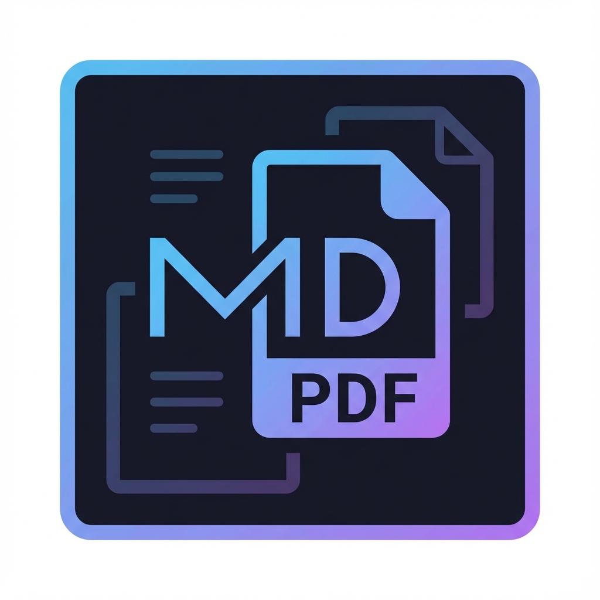
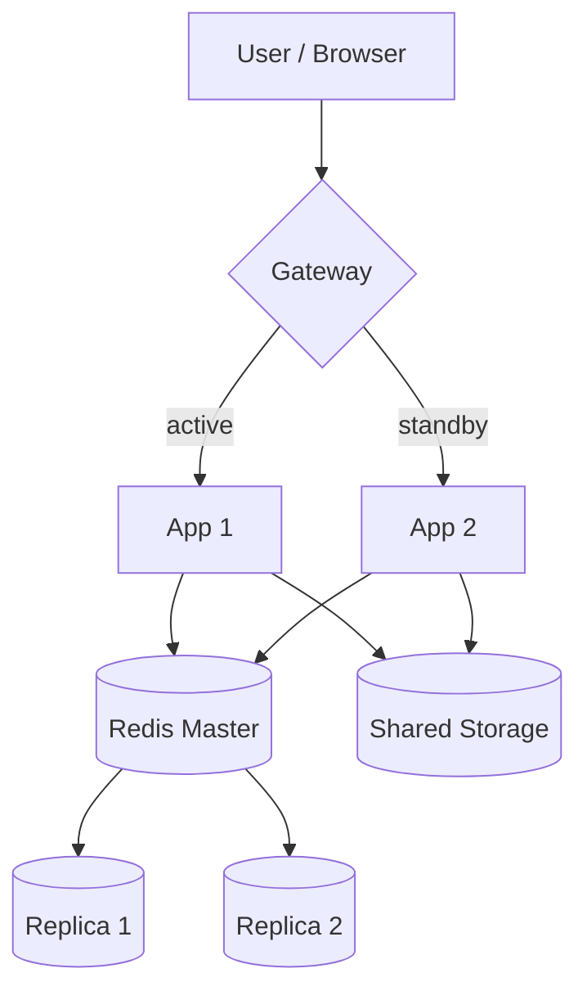
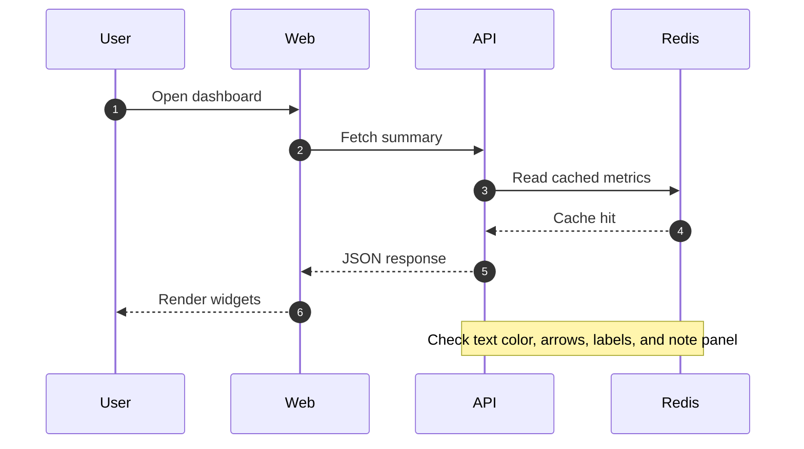
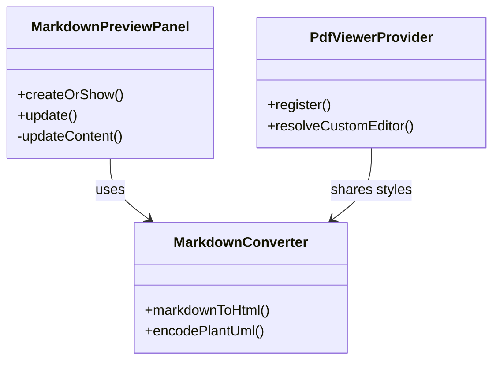
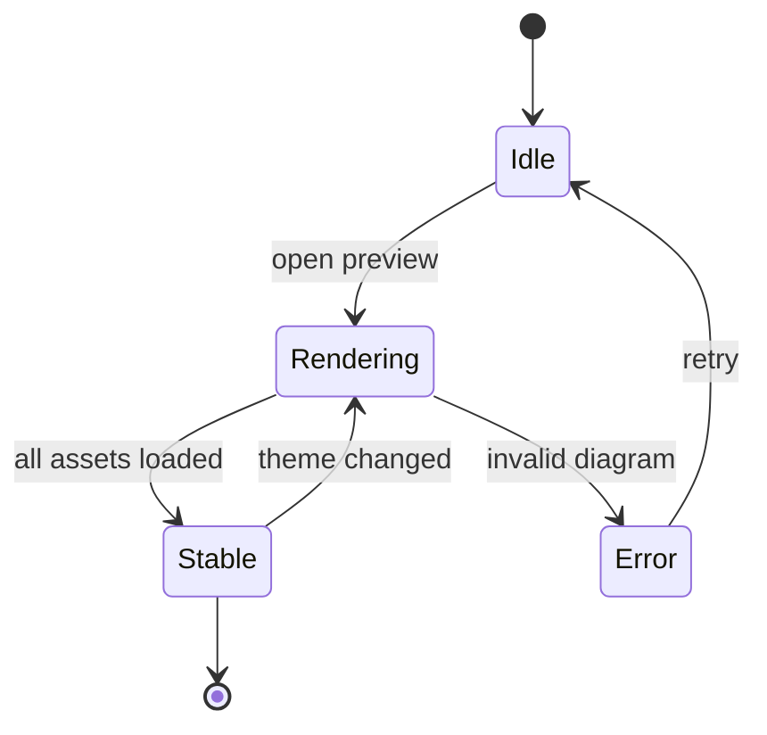
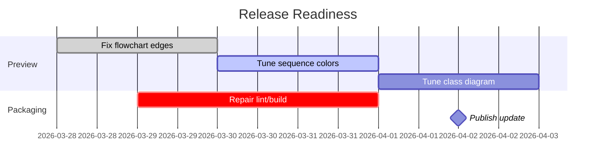
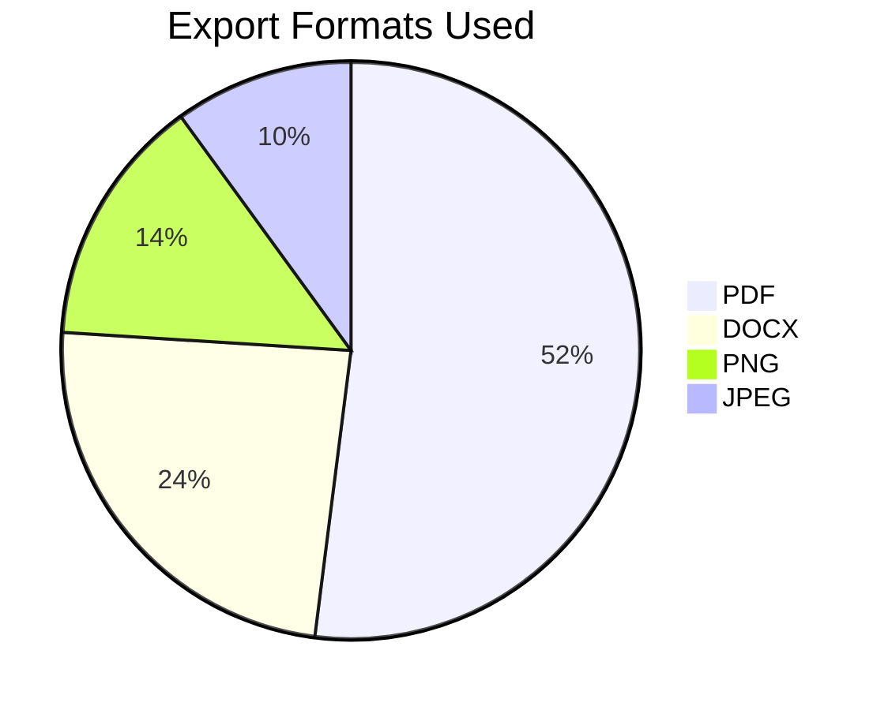

# Preview Showcase

This file is a playground for checking the custom preview.

---

## Basic Markdown

### Text styles

Normal text, **bold text**, *italic text*, `inline code`, and a [link to VS Code](https://code.visualstudio.com/).

### Lists

- Alpha
- Beta
- Gamma

1. First
2. Second
3. Third

### Blockquote

> A preview is only useful if typography, spacing, colors, and diagrams all hold together.

### Table

| Service | Host | Status |
| --- | --- | ---: |
| API | `10.29.100.2` | 200 |
| Redis | `10.29.100.4` | 6379 |
| NFS | `10.29.100.3` | 2049 |

---

## HTML Blocks

<details open>
<summary><b>Expandable details block</b></summary>

- This checks safe HTML rendering.
- It also checks spacing inside `<details>`.

</details>

<div align="center">

### Centered Content

This paragraph should stay centered.



</div>

---

## Math

Inline math: $E = mc^2$

Block math:

$$
\int_0^1 x^2 \, dx = \frac{1}{3}
$$

---

## Code Blocks

```ts
export function sum(a: number, b: number): number {
  return a + b;
}
```

```json
{
  "name": "mdx-exporter-lite",
  "preview": true,
  "formats": ["pdf", "docx", "png", "jpeg"]
}
```

---

## Badge Row

[](./CHANGELOG.md)
[](./LICENSE)
[](https://code.visualstudio.com/)

---

## Mermaid Flowchart



## Mermaid Sequence Diagram



## Mermaid Class Diagram



## Mermaid State Diagram



## Mermaid Gantt



## Mermaid Pie



---

## Mixed Layout Stress Test

| Area | What to inspect |
| --- | --- |
| Typography | Headings, paragraph width, code font |
| Components | Tables, details, blockquotes, image alignment |
| Mermaid | Node fill, border contrast, line stroke, labels, arrowheads |
| Theme switch | Preview after toggling light/dark theme |

Final line for checking paragraph spacing after a large mixed document.
