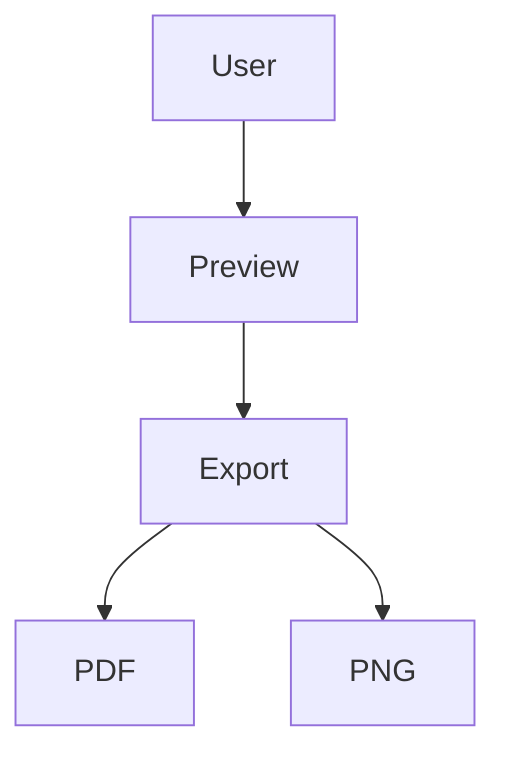

# Visual Regression Fixture

This fixture is intentionally deterministic so image snapshots stay stable.

---

## Layout

> Export output should keep spacing, borders, and typography stable.

| Area | Expectation |
| --- | --- |
| Heading | Consistent weight and separator |
| Table | Stable borders and row striping |
| Code | Card toolbar and monospace block |

<details open>
<summary><b>Details Block</b></summary>

- Expanded by default
- Checks spacing inside safe HTML

</details>

<div align="center">

### Centered Icon Row

[](./visual-regression.md)
[](./visual-regression.md)
[](./visual-regression.md)

</div>

```ts
export function sum(a: number, b: number): number {
  return a + b;
}
```

```json
{
  "feature": "visual-regression",
  "theme": "stable",
  "layout": ["table", "details", "code", "mermaid"]
}
```


