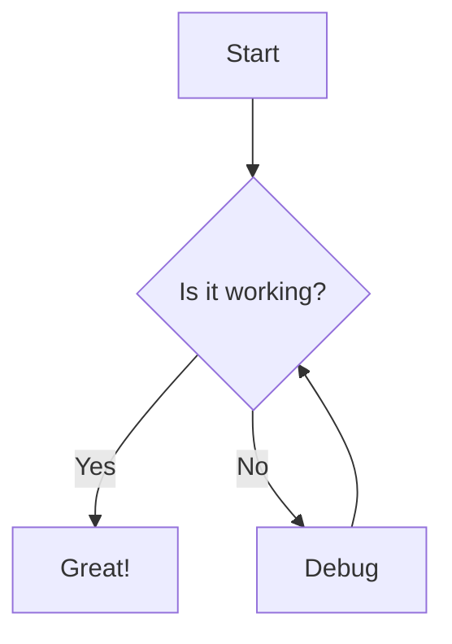
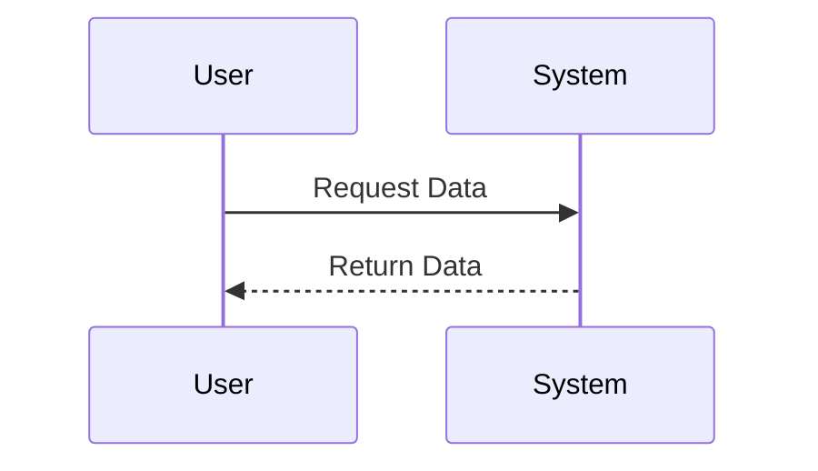
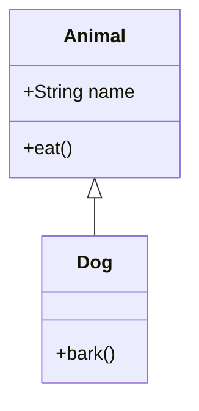
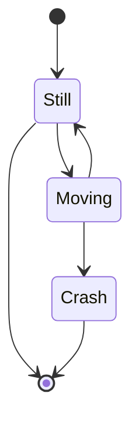
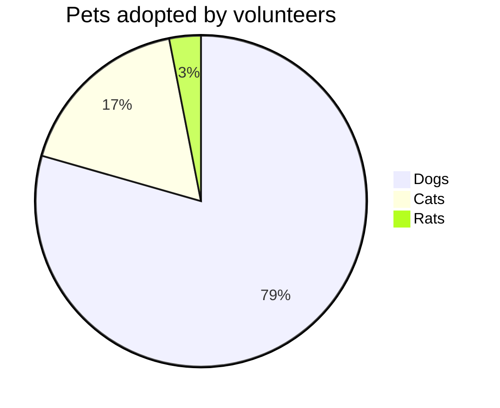
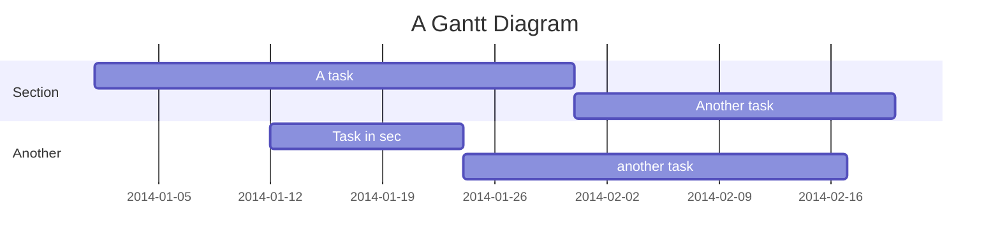

# Mermaid Diagram Test

This file contains various Mermaid diagrams to test the rendering capabilities.

## Flowchart

## Sequence Diagram

## Class Diagram

## State Diagram

## Pie Chart

## Gantt Chart

